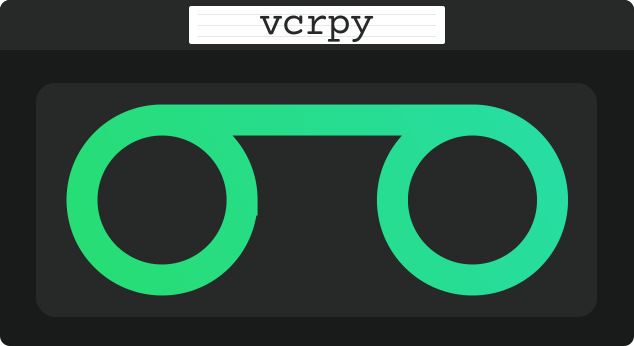

Contributing
============

🚀 Milestones
--------------
For anyone interested in the roadmap and projected release milestones please see the following link:

`MILESTONES <https://github.com/kevin1024/vcrpy/milestones>`_

----

🎁 Contributing Issues and PRs
-------------------------------

 - Issues and PRs will get triaged and assigned to the appropriate milestone.
 - PRs get priority over issues.
 - The maintainers have limited bandwidth and do so **voluntarily**.

So whilst reporting issues are valuable, please consider:
 - contributing an issue with a toy repo that replicates the issue.
 - contributing PRs is a more valuable donation of your time and effort.

Thanks again for your interest and support in VCRpy. 

We really appreciate it.

----

👥 Collaborators
-----------------

We also have a large test matrix to cover and would like members to volunteer covering these roles.

============ ==================== ================= ================== ======================
**Library**  **Issue Triager(s)** **Maintainer(s)** **PR Reviewer(s)** **Release Manager(s)**
------------ -------------------- ----------------- ------------------ ----------------------
``core``     Needs support        Needs support     Needs support      @neozenith
``requests`` @neozenith           Needs support     @neozenith         @neozenith
``aiohttp``  Needs support        Needs support     Needs support      @neozenith
``urllib3``  Needs support        Needs support     Needs support      @neozenith
``httplib2`` Needs support        Needs support     Needs support      @neozenith
``tornado4`` Needs support        Needs support     Needs support      @neozenith
``boto3``    Needs support        Needs support     Needs support      @neozenith
============ ==================== ================= ================== ======================

Role Descriptions
~~~~~~~~~~~~~~~~~

**Issue Triager:**

Simply adding these three labels for incoming issues means a lot for maintaining this project:
 -  ``bug`` or ``enhancement``
 - Which library does it affect? ``core``, ``aiohttp``, ``requests``, ``urllib3``, ``tornado4``, ``httplib2``
 - If it is a bug, is it ``Verified Can Replicate`` or ``Requires Help Replicating``
 - Thanking people for raising issues. Feedback is always appreciated.
 - Politely asking if they are able to link to an example repo that replicates the issue if they haven't already. Being able to *clone and go* helps the next person and we like that. 😃 

**Maintainer:**

This involves creating PRs to address bugs and enhancement requests. It also means maintaining the test suite, docstrings and documentation .

**PR Reviewer:**

The PR reviewer is a second set of eyes to see if:
 - Are there tests covering the code paths added/modified?
 - Do the tests and modifications make sense seem appropriate?
 - Add specific feedback, even on approvals, why it is accepted. eg "I like how you use a context manager there. 😄 " 
 - Also make sure they add a line to `docs/changelog.rst` to claim credit for their contribution.

**Release Manager:**
 - Ensure CI is passing.
 - Create a release on github and tag it with the changelog release notes.
 - ``python setup.py build sdist bdist_wheel``
 - ``twine upload dist/*``
 - Go to ReadTheDocs build page and trigger a build https://readthedocs.org/projects/vcrpy/builds/

----

Running VCR's test suite
------------------------

The tests are all run automatically on `Travis
CI <https://travis-ci.org/kevin1024/vcrpy>`__, but you can also run them
yourself using `pytest <http://pytest.org/>`__ and
`Tox <http://tox.testrun.org/>`__. 

Tox will automatically run them in all environments VCR.py supports if they are available on your `PATH`. Alternatively you can use `tox-pyenv <https://pypi.org/project/tox-pyenv/>`_ with 
`pyenv <https://github.com/pyenv/pyenv>`_. 
We recommend you read the documentation for each and see the section further below.

The test suite is pretty big and slow, but you can tell tox to only run specific tests like this::

    tox -e {pyNN}-{HTTP_LIBRARY} -- <pytest flags passed through>

    tox -e py36-requests -- -v -k "'test_status_code or test_gzip'"
    tox -e py37-requests -- -v --last-failed

This will run only tests that look like ``test_status_code`` or
``test_gzip`` in the test suite, and only in the python 3.6 environment
that has ``requests`` installed.

Also, in order for the boto tests to run, you will need an AWS key.
Refer to the `boto
documentation <https://boto.readthedocs.io/en/latest/getting_started.html>`__
for how to set this up. I have marked the boto tests as optional in
Travis so you don't have to worry about them failing if you submit a
pull request.

Using PyEnv with VCR's test suite
---------------------------------

PyEnv is a tool for managing multiple installation of python on your system.
See the full documentation at their `github <https://github.com/pyenv/pyenv>`_ 
but we are also going to use `tox-pyenv <https://pypi.org/project/tox-pyenv/>`_ 
in this example::

    git clone https://github.com/pyenv/pyenv ~/.pyenv

    # Add ~/.pyenv/bin to your PATH
    export PATH="$PATH:~/.pyenv/bin"

    # Setup shim paths
    eval "$(pyenv init -)"

    # Setup your local system tox tooling
    pip install tox tox-pyenv

    # Install supported versions (at time of writing), this does not activate them
    pyenv install 3.6.9 3.7.5 3.8.0 pypy3.6-7.2.0

    # This activates them
    pyenv local 3.6.9 3.7.5 3.8.0 pypy3.6-7.2.0

    # Run the whole test suite
    tox

    # Run the whole test suite or just part of it
    tox -e lint
    tox -e py37-requests

Troubleshooting on MacOSX
-------------------------

If you have this kind of error when running tox :

.. code:: python

    __main__.ConfigurationError: Curl is configured to use SSL, but we have
    not been able to determine which SSL backend it is using. Please see PycURL documentation for how to specify the SSL backend manually.

Then you need to define some environment variables:

.. code:: bash

    export PYCURL_SSL_LIBRARY=openssl
    export LDFLAGS=-L/usr/local/opt/openssl/lib
    export CPPFLAGS=-I/usr/local/opt/openssl/include

Reference : `stackoverflow issue <https://stackoverflow.com/questions/51019622/curl-is-configured-to-use-ssl-but-we-have-not-been-able-to-determine-which-ssl>`__
